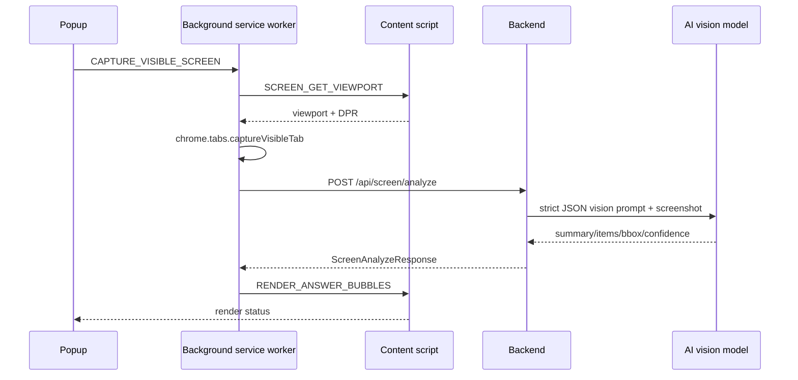

# Screen Bubble Architecture

## Goal

The primary Mako IQ output is no longer a Canvas LMS sidebar. The primary output is transparent, anchored answer bubbles rendered directly on the user's current page after screenshot analysis.

## End-To-End Flow



## Responsibilities

Popup:

- Shows Mako IQ branding, status pill, and primary `Analyze Screen` button.
- Sends `CAPTURE_VISIBLE_SCREEN` to the background service worker.
- Sends `CLEAR_ANSWER_BUBBLES`.
- Opens workspace/settings as secondary actions.
- Does not render page bubbles directly.

Background service worker:

- Resolves the active browser tab even when the popup/launcher has focus.
- Ensures the content script is available.
- Reads viewport dimensions from the content script.
- Captures the visible tab screenshot with `chrome.tabs.captureVisibleTab`.
- Calls backend screen endpoints.
- Sends render/clear commands to the content script with `chrome.tabs.sendMessage`.
- Handles follow-up requests from bubbles.

Backend:

- Owns AI calls and prompt/schema enforcement.
- Provides `POST /api/screen/analyze`.
- Provides `POST /api/screen/follow-up`.
- Returns strict JSON, not prose.
- Applies restricted assessment guardrails.

Content script:

- Creates `<div id="mako-iq-overlay-root"></div>`.
- Uses Shadow DOM to avoid page CSS conflicts.
- Maps normalized coordinates to viewport-fixed positions.
- Renders answer bubbles, empty states, restricted-assessment messages, and scroll-stale prompts.
- Persists user-dragged bubble positions in `chrome.storage.local`.

## Bubble Placement

AI returns normalized coordinates:

```ts
viewportX = bbox.x * window.innerWidth
viewportY = bbox.y * window.innerHeight
viewportW = bbox.width * window.innerWidth
viewportH = bbox.height * window.innerHeight
```

Default placement:

- Right of the detected question: `x = viewportX + viewportW + 12`, `y = viewportY`.
- If it overflows right, place left of the question.
- If it overflows left, clamp to `16px`.
- If it overflows bottom, clamp to `window.innerHeight - bubbleHeight - 16`.
- If it overflows top, clamp to `16px`.
- If no usable `bbox` exists, place results in a top-right stack.

The overlay uses `position: fixed` because `captureVisibleTab` captures the visible viewport, not the full page document.

## Bubble Behavior

Collapsed state:

- Label: `Answer`
- Short question preview
- Short answer preview
- Confidence dot
- Expand and hide controls

Expanded state:

- Recommended Answer
- Full answer
- Why this fits
- Follow-up input
- Copy and hide-explanation controls

Interaction:

- Drag from the bubble header.
- Double-click toggles expanded state.
- Hide removes a single bubble.
- `Clear Bubbles` removes all bubbles.
- Follow-up submits through `ASK_BUBBLE_FOLLOWUP`.

## Scroll Handling

The screenshot only matches the viewport at capture time. The content script records `scrollX` and `scrollY` at render time.

If the user scrolls more than 150px:

- Existing bubbles are faded.
- A small prompt appears: `Screen changed. Re-analyze to update bubbles.`

The current implementation does not attempt to remap old screenshot coordinates after scrolling.

## Error And Empty States

Screenshot capture failure:

- Popup shows: `Couldn't capture this screen. Try refreshing the page or granting permissions.`

Backend/network failure:

- Popup shows: `Mako IQ could not reach the AI service.`

No questions:

- Content script shows a small top-right message: `No clear questions found on this screen.`

Restricted/proctored page:

- Backend returns no direct answers and warning `RESTRICTED_ASSESSMENT`.
- Content script shows: `Mako IQ can help explain concepts or create study notes, but it will not provide live answers for restricted assessments.`

Missing coordinates:

- The content script renders a top-right stack instead of failing.

## Workspace Role

The side panel remains useful, but it is no longer the main experience. It should hold:

- Analysis history
- Longer explanations
- Study notes
- Follow-up chat
- Settings and diagnostics

The immediate answer surface is the bubble overlay.

## Files

- Popup UI: [src/canvy/popup/App.tsx](../src/canvy/popup/App.tsx)
- Background pipeline: [src/canvy/background/main.ts](../src/canvy/background/main.ts)
- Content bridge: [src/canvy/content/main.tsx](../src/canvy/content/main.tsx)
- Bubble overlay: [src/canvy/content/screenBubbles.ts](../src/canvy/content/screenBubbles.ts)
- Frontend API client: [src/canvy/services/api.ts](../src/canvy/services/api.ts)
- Backend route: [backend/src/routes/screen.ts](../backend/src/routes/screen.ts)
- Backend AI service: [backend/src/services/screen-analysis.ts](../backend/src/services/screen-analysis.ts)
